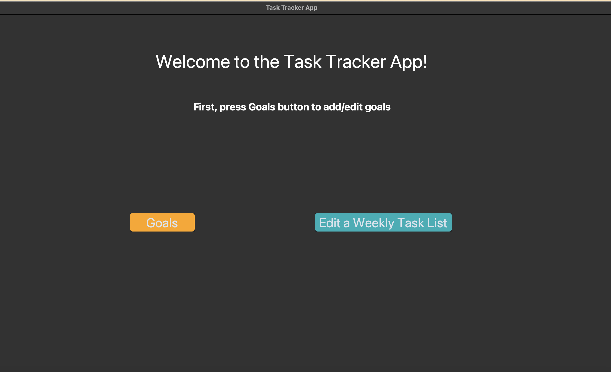
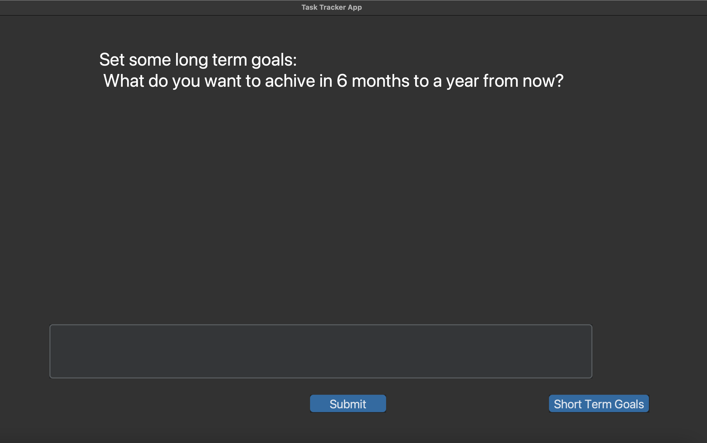
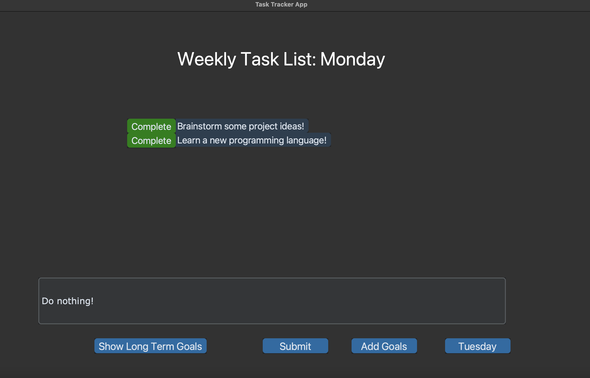

# TaskTrackerGUI
This is a python program(GUI) that lets you keep track of your goals and weekly tasks.

How to:
1. Git clone the repo.

2. Install necessary python packages with  "pip3 install -r requirements.txt" 

3. Run the program!

Python3 main.py

You can also create an icon on your desktop that opens up when you click it by following steps below:

1.pip3 install pyshortcut
2.pyshortcut -n tasks APP_FOLDERPATH/main.py -d -g

#this program only supports the dark mode in MAC at the moment. Please go to your System Preferences > General to change it to Dark mode if you want the app to look normal.

<h2>Basic Functionalities</h2>
### data is saved in excel sheets so it won't be deleted even if you close out the App! 
Main Menu 
 

1. Add Longterm/ Short Term Goals

2. Add / Complete Weekly Task list.

 - It lets you look at the Long-term/short-term goals you set / create a task list for each day. Once you complete a task, you just hit the complete button and it disappears from the data file. 
 

